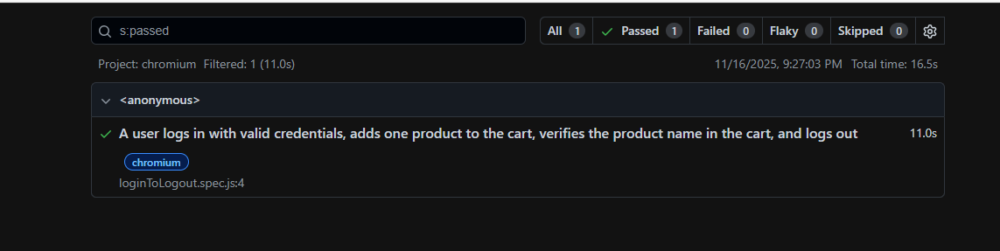
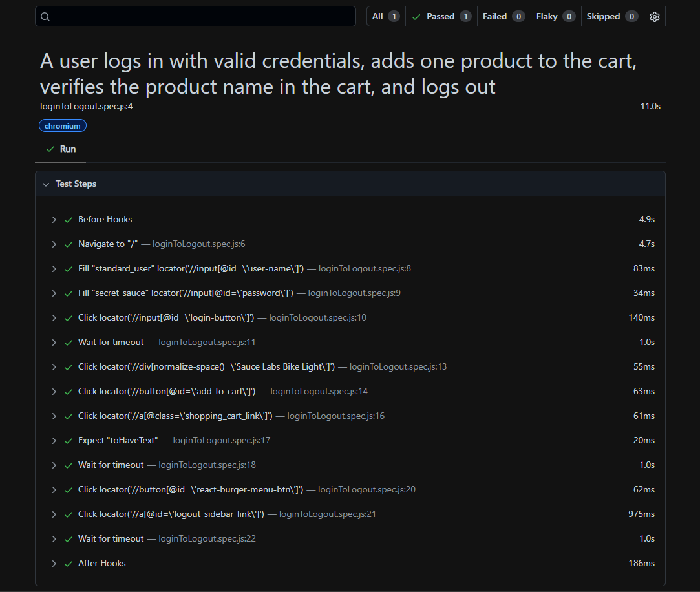

# SauceDemo-Playwright
SauceDemo E2E Test Automation Framework (Playwright)

This repository contains an end-to-end (E2E) test automation framework for the SauceDemo e-commerce website, built using Playwright and JavaScript.

The primary goal is to validate the critical user journey: logging in, adding a product to the cart, verifying the cart, and logging out.

🧪 Test Scenario Details

This framework currently tests the following end-to-end user flow (loginToLogout.spec.js):

* Navigate: Opens the SauceDemo login page.

* Login: Enters valid credentials (standard_user and secret_sauce) and logs in.

* Add to Cart: Selects the "Sauce Labs Bike Light" and adds it to the cart.

* Verify Cart: Navigates to the shopping cart page.

* Assert: Verifies that the cart contains the correct item ("Sauce Labs Bike Light").

* Logout: Opens the side menu and successfully logs out, returning to the login page.

✨ Code Highlight

Tests are written to be readable, maintainable, and resilient. This project uses Playwright's best practices, such as await syntax and data-driven locators.

(This uses your first image image_e5fd35.png. You must add this file to your project folder for it to appear.)

🛠️ Tech Stack

* Test Runner: Playwright

* Language: JavaScript (ESNext)

* Package Manager: npm

📂 How to Run This Project (Locally)

If you would like to run the tests on your own machine, you can follow these steps.

1. Prerequisites

* Node.js (v18 or higher)
  
* Git

2. Clone & Install

``` ### Clone this repository
git clone [ https://github.com/Progga-Roy/SauceDemo-Playwright.git]
```
```
 Install all dependencies from package.json
 `npm install`

 Install Playwright's browser binaries
`npx playwright install`

 Run all tests in headed mode (watch the browser)
`npx playwright test --headed`

 Open the last test report in your browser
`npx playwright show-report`
```
### View the Test Report
After the tests run, a playwright-report folder is created. To view the interactive HTML report:




